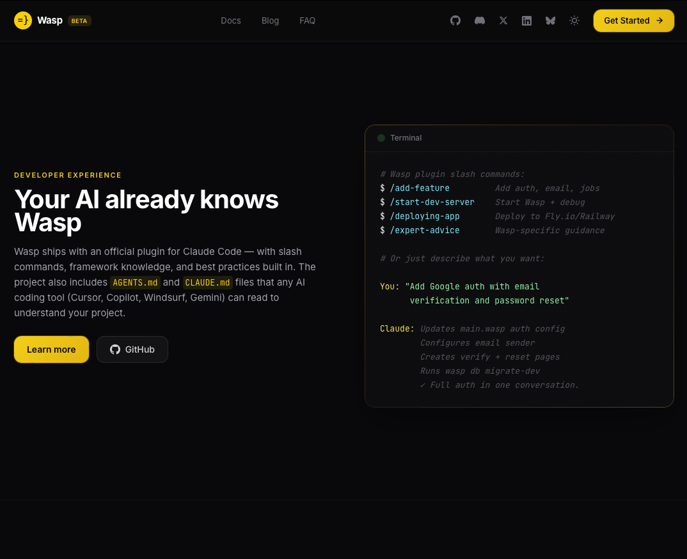
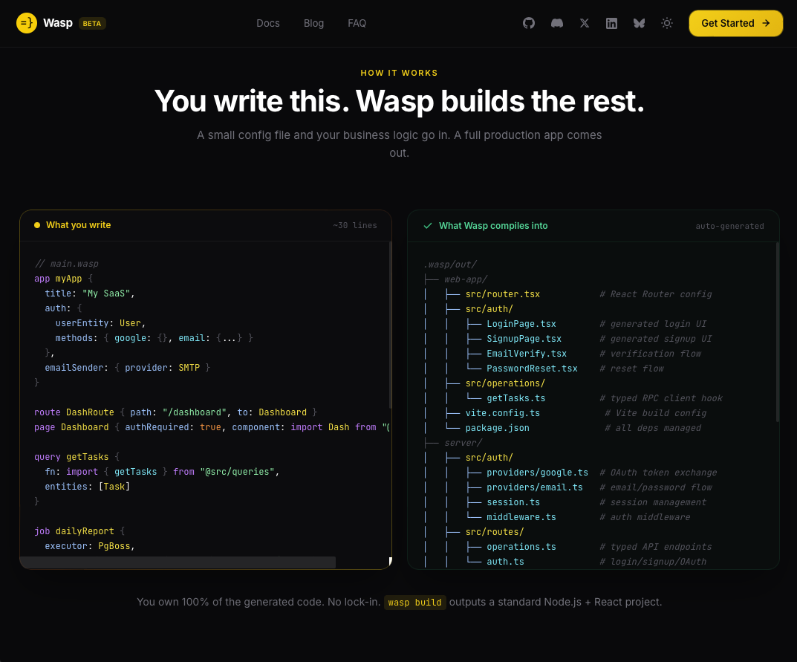

# Wasp Landing Page — Community Design Concept

> **This is not an official Wasp project.** It is an unofficial community contribution exploring a redesigned landing page for Wasp. It is not affiliated with or endorsed by the Wasp team.

**[Live Demo](http://jzib87h2meabr0g0w6tpiznl.152.53.230.125.sslip.io/)**

## Screenshots







## About

A redesigned landing page concept for [Wasp](https://wasp-lang.dev), the full-stack React & Node.js framework. Built with Wasp itself to showcase the developer experience.

### Links

- **Wasp website**: [wasp-lang.dev](https://wasp-lang.dev)
- **Wasp GitHub**: [github.com/wasp-lang/wasp](https://github.com/wasp-lang/wasp)
- **Wasp docs**: [wasp-lang.dev/docs](https://wasp-lang.dev/docs)
- **OpenSaaS starter**: [opensaas.sh](https://opensaas.sh)
- **Discord**: [discord.gg/rzdnErX](https://discord.gg/rzdnErX)

## Tech Stack

- [Wasp](https://wasp-lang.dev) — full-stack framework
- [React](https://react.dev) + [Tailwind CSS](https://tailwindcss.com) — frontend
- [Vite](https://vite.dev) — build tool

## Development

```bash
wasp start db    # start the database (required by Wasp even for this static page)
wasp start       # start the dev server
```

## Build & Deploy

The `dist/` folder contains the pre-built static site. To rebuild after making changes:

```bash
wasp build
cd .wasp/build/web-app && npm install && npx vite build
cp -r .wasp/build/web-app/build dist
```

To deploy with Docker (works with Coolify, Railway, Fly.io, etc.):

```bash
docker build -t wasp-landing .
docker run -p 3000:80 wasp-landing
```

The `Dockerfile` serves the `dist/` folder with nginx. Point any Docker-based hosting platform (e.g. Coolify) at this repo and it will auto-detect the Dockerfile.

## License

This is an open community contribution. Wasp itself is [MIT licensed](https://github.com/wasp-lang/wasp/blob/main/LICENSE).
